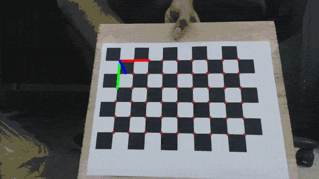
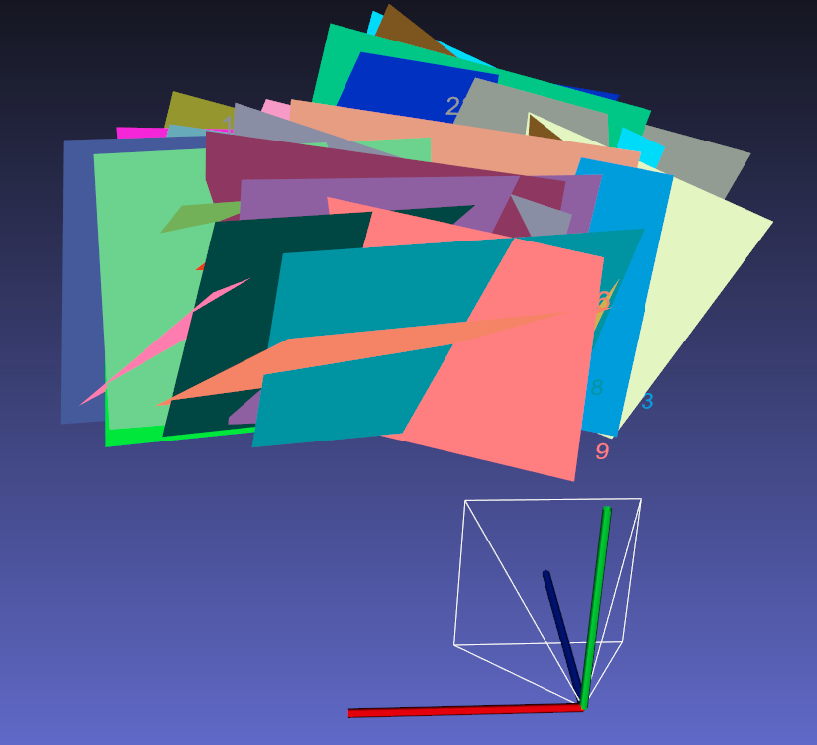

# 📝 Camera Intrinsic Calibration by [Zhang's method](https://www.microsoft.com/en-us/research/wp-content/uploads/2016/02/tr98-71.pdf) from (almost^^) scratch #

## :tada: TODO
***

- [x] Implementation of [Zhang's method](https://www.microsoft.com/en-us/research/wp-content/uploads/2016/02/tr98-71.pdf)
- [x] Test on real data

- visualization of reprojection of board corners on image and board poses

<p align="center">
  
</p>

- board poses in camera frame

<p align="center">
  
</p>

## 🎛  Dependencies
***

- from debian

```bash
sudo apt-get install \
    libopencv-dev \
    rapidjson-dev \
```

- [Ceres solver](https://github.com/ceres-solver/ceres-solver)

## 🔨 How to Build ##
***

## :running: How to Run ##
***

```bash
# after make apps

./build/examples/calib_app ./data/param_config.json

# sample calibration images already stored in data
```

## :gem: References ##
***
- [A Flexible New Technique for Camera Calibration](https://www.microsoft.com/en-us/research/wp-content/uploads/2016/02/tr98-71.pdf)
- [Zhang's Camera Calibration Algorithm: In-Depth Tutorial and Implementation](https://www.researchgate.net/publication/303233579_Zhang's_Camera_Calibration_Algorithm_In-Depth_Tutorial_and_Implementation)
- [A python implementation](https://github.com/goldbema/CameraCalibration)
- [In Defense of the Eight-Point Algorithm](https://www.cse.unr.edu/~bebis/CS485/Handouts/hartley.pdf)
